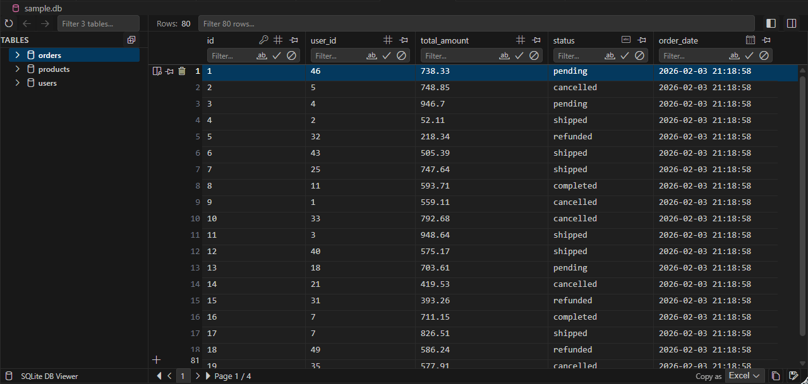

# SQLite DB Viewer

**SQLite DB Viewer** is a professional database explorer for Visual Studio Code. It allows developers to view, analyze, filter, and edit SQLite databases (`.db`, `.sqlite`, `.sqlite3`) directly within the editor. The interface is meticulously designed to match the native look and feel of VS Code, ensuring a seamless workflow.

## Features

### Native User Interface
The extension adapts automatically to your VS Code color theme. Fonts, spacing, and interactive elements mirror the native environment, providing a consistent experience whether you use a light, dark, or high-contrast theme.

### High Performance
Built to handle real-world data, the viewer utilizes virtualized scrolling to render large datasets smoothly. You can browse tables with thousands of rows without performance degradation.

### Advanced Filtering
Quickly find the data you need with powerful search capabilities:
*   **Global Search**: Filter rows across all columns instantly using the search bar in the sidebar.
*   **Column-Specific Filtering**: Apply precise filters to individual columns. Supported operators include:
    *   `> 100` (Greater than)
    *   `< 50` (Less than)
    *   `= value` (Exact match)
    *   `text*` (Starts with)
    *   `*text` (Ends with)
    *   `!empty` (Is not empty)

### Data Management
*   **Inline Editing**: Double-click any cell to modify its content. Changes are committed immediately.
*   **Row Management**: Add new rows via the interface or delete existing ones. Multi-selection is supported for bulk operations.
*   **Note**: Editing capabilities require the table to have a `ROWID` or `PRIMARY KEY`.

### Export Options
Export your data or query results in various industry-standard formats:
*   **CSV, TSV, Excel**: For spreadsheet analysis.
*   **JSON**: Export as an Object or Array for programmatic use.
*   **HTML, Markdown**: For documentation and reporting.
*   **SQL INSERT**: Generate SQL statements to recreate the data.

## Usage

1.  **Open Database**: Click on any `.db`, `.sqlite`, or `.sqlite3` file in the VS Code Explorer.
2.  **Navigation**: Use the sidebar to switch between tables.
3.  **Analysis**: Sort columns by clicking headers, pin important columns to the left, and use filters to drill down into data.
4.  **Modification**: Edit cells directly in the grid. Use the context menu (right-click) to delete rows or copy data.

## Privacy and Security

*   **Offline Operation**: This extension runs entirely locally on your machine.
*   **No Telemetry**: No usage data or database content is sent to external servers.
*   **Sandboxed Environment**: The viewer operates within VS Code's secure webview sandbox.

## Requirements

*   Visual Studio Code version 1.85.0 or higher.
*   A valid SQLite database file.

## License

This project is licensed under the MIT License.
